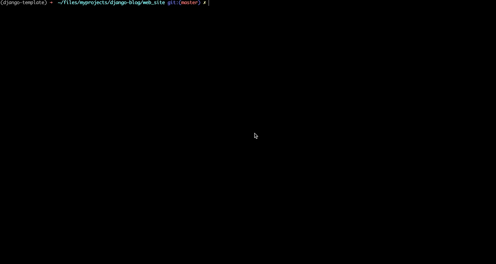

[](https://www.python.org/)
[](https://github.com/psf/black)
[](https://pycqa.github.io/isort/)

# Personal blog

> Describes a simple blog using django framework. Inspired by and based on [Django Full Stack Udemy training](https://www.udemy.com/course/python-and-django-full-stack-web-developer-bootcamp).

## Tools

### Production

- python 3.6+
- [sqlite3](https://www.sqlite.org/index.html) database
- [django](https://www.djangoproject.com/) framework
- html & css
- bootstrap

### Development

- [black](https://black.readthedocs.io/en/stable/) code formatter
- [isort](https://pycqa.github.io/isort/) import sorting tool

## Usage



### Quick start

```
git clone git@github.com:vyahello/django-blog.git
cd django-blog
pip install -r requirements.txt
cd web_site
python manage.py runserver
```

Then please open `http://127.0.0.1:8000` endpoint in the browser.

## Development notes

### Startup 

Please follow the next instructions to create fresh app:
```bash
django-admin startproject project_name
cd project_name 
django-admin startapp project_app
python app/manage.py createsuperuser
```

### DB migration

DB migration is performed in case of table changes (e.g new field or column added):

Please follow the next instructions to migrate DB:
```bash
cd web_site
python manage.py migrate
python manage.py makemigrations app
python manage.py migrate
```

### Meta

Author – _Volodymyr Yahello_. 

Distributed under the `MIT` license. See [LICENSE](LICENSE.md) for more information.

You can reach out me at:
* [vyahello@gmail.com](vyahello@gmail.com)
* [https://twitter.com/vyahello](https://twitter.com/vyahello)
* [https://www.linkedin.com/in/volodymyr-yahello-821746127](https://www.linkedin.com/in/volodymyr-yahello-821746127)

### Contributing
If you are interested to add your ideas into project please follow next simple steps:

1. Clone the repository
2. Configure `git` for the first time after cloning with your `name` and `email`
3. `pip install -r requirements.txt` to install all project dependencies
4. `pip install -r requirements-dev.txt` to install all project dev dependencies
5. Create your feature branch (`git checkout -b feature/fooBar`)
6. Commit your changes (`git commit -am 'Add some fooBar'`)
7. Push to the branch (`git push origin feature/fooBar`)
8. Create a new Pull Request
